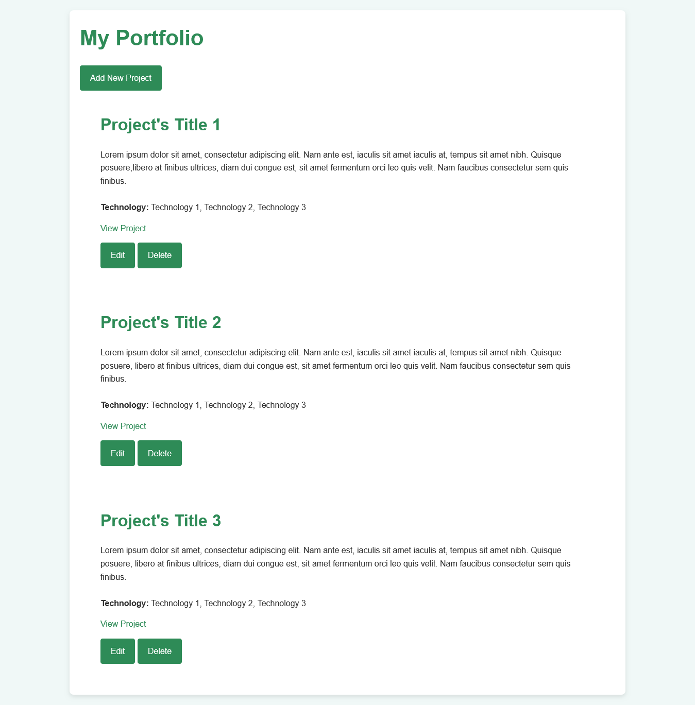
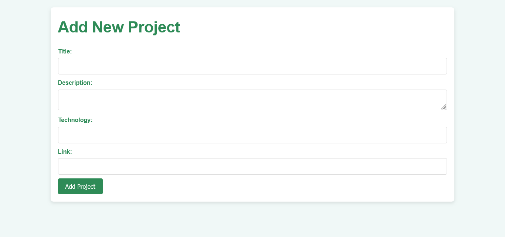
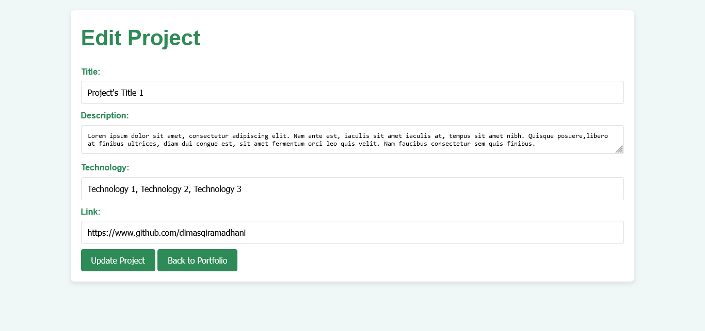

# Portfolio Proyek Manajemen

Aplikasi Portfolio Proyek Manajemen adalah aplikasi web portfolio yang menerapkan sistem CRUD untuk mengelola data proyek. Aplikasi ini dibangun menggunakan Python dengan Flask sebagai antarmuka web dan PostgreSQL sebagai database.

## Review

Berikut adalah contoh tampilan aplikasi:

- **Homepage**



- **Add Project**



- **Edit Project**



## Fitur

- **CRUD (Create, Read, Update, Delete)** untuk kategori dan pemasok.
- Tampilan yang responsif dan modern menggunakan Python dan Flask.
- Menggunakan database PostgreSQL untuk penyimpanan data.

## Teknologi

Teknologi yang digunakan:

- Python 3.7 atau yang lebih baru
- PostgreSQL
- `pip` untuk instalasi paket Python

## Struktur Direktori

```bash
portfolio_app/
│
├── app/
│   ├── __init__.py
│   ├── models.py
│   ├── routes.py
│   └── static/
│   │   ├── style.css
│   └── templates/
│       ├── index.html
│       ├── add_project.html
│       ├── edit_project.html
│
├── images/
│   ├── index.png
│   ├── add_project.png
│   ├── edit_project.png
│
├── .env
├── config.py
├── app.py
├── requirements.txt
├── seed.py
└── README.md
```

## Kontak

    Jika Anda memiliki pertanyaan atau saran, silakan hubungi [dimasqiramadhani@gmail.com](mailto:dimasqiramadhani@gmail.com).
